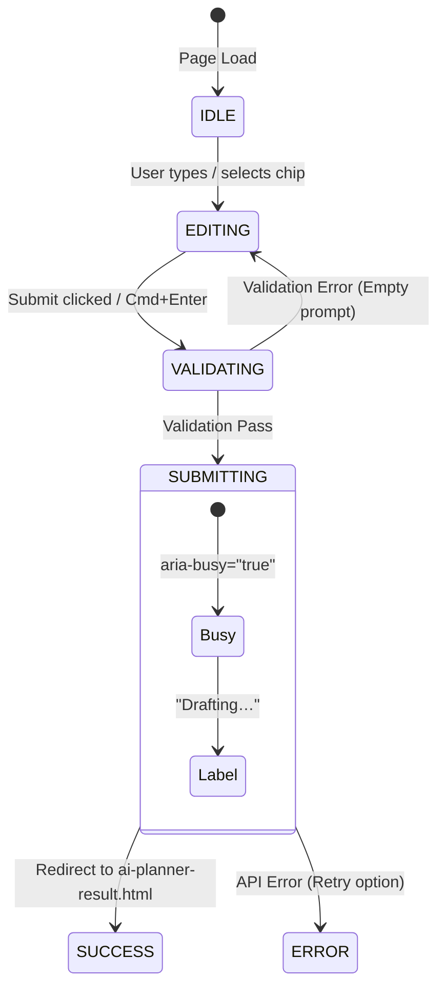

# Travel AI Frontend Integration Contract

This document defines the formal frontend integration contracts, architectural boundaries, data models, state flows, DOM hooks, and routing conventions for the Travel AI web platform. It serves as the definitive reference for backend engineers, AI engineers, and external teams connecting production APIs, AI models, and databases to the existing user interface.

---

## 1. Architecture Overview

Travel AI utilizes a lightweight, modern, dependency-free vanilla JavaScript architecture designed to function seamlessly across both standard browser script environments and ES module runtimes.

```
┌────────────────────────────────────────────────────────┐
│                   User Interface (UI)                  │
│       Semantic HTML5 + Scoped CSS + Design Tokens      │
└───────────────────────────▲────────────────────────────┘
                            │ (Events & Renders)
┌───────────────────────────┴────────────────────────────┐
│                  Frontend Controllers                  │
│   js/journeys.js · js/contact.js · js/site.js          │
└─────────────▲────────────────────────────▲─────────────┘
              │ (Normalizes & Queries)     │ (Presentation Enhancements)
┌─────────────┴─────────────┐  ┌───────────┴─────────────┐
│       Service Layer       │  │   TravelMotion Engine   │
│ js/services/planner-*.js  │  │ js/motion/gsap-engine.js│
│ js/services/journeys-*.js │  │  (Strictly Presentation)│
│ js/services/contact-*.js  │  └─────────────────────────┘
└─────────────▲─────────────┘
              │ (Fetch / REST / GraphQL / Streaming)
┌─────────────┴─────────────┐
│    Future Backend / AI    │
│  Itinerary Generation API │
│  Packages CMS / DB API    │
│  Contact CRM / Lead API   │
└───────────────────────────┘
```

### Core Architecture Rules:
1. **Presentation & Business Logic Decoupling**: Business logic and data manipulation must never live inside GSAP timelines or CSS declarations.
2. **Deterministic Flow**:
   $$\text{Application State} \longrightarrow \text{DOM Normalization \& Render} \longrightarrow \text{TravelMotion Presentation Enhancement}$$
3. **No External Framework Dependencies**: No React, Vue, Angular, Redux, or heavy client-side routers are required.
4. **Universal Service Interface**: All services export ES modules and register globally on `window.TravelServices` for unified access across deferred scripts and ES modules.

---

## 2. Planner Request Contract

The AI Travel Planner (`ai-planner.html` and the query header in `ai-planner-result.html`) captures the user's travel vision.

### TypeScript Definition
```typescript
interface PlannerRequest {
  /** Target destination identifier */
  destination: 'dubai' | 'japan' | string;

  /** Raw travel prompt describing dates, preferences, pace, and interests */
  prompt: string;

  /** Optional suggested attraction chip clicked by user */
  selectedChip?: string | null;

  /** Client ISO 8601 generation timestamp */
  timestamp?: string;
}
```

### Field Specification
| Field | Type | Required | Allowed Values | Default Value | Validation Rules |
| :--- | :--- | :---: | :--- | :--- | :--- |
| `destination` | `string` | **Yes** | `'dubai'`, `'japan'` (extensible) | `'dubai'` | Must match supported destination key. |
| `prompt` | `string` | **Yes** | Free text | Pre-filled default per destination | 1–2000 characters; non-empty when trimmed. |
| `selectedChip` | `string` | No | Any attraction name | `null` | String if user selected a suggestion chip. |
| `timestamp` | `string` | No | ISO 8601 string | `new Date().toISOString()` | Valid date string. |

### Service Method
* `TravelServices.planner.generateItinerary(request: PlannerRequest): Promise<PlannerResult>`
* `TravelServices.planner.validatePlannerRequest(request: PlannerRequest): { isValid: boolean, error?: string }`

---

## 3. Planner Result Contract

The AI Planner Result page (`ai-planner-result.html`) displays the generated multi-day itinerary.

### TypeScript Definition
```typescript
interface PlannerActivity {
  /** Period of day */
  timeOfDay: 'Morning' | 'Afternoon' | 'Evening' | string;

  /** Activity headline */
  title: string;

  /** Editorial narrative description */
  description: string;

  /** Image asset URL or path */
  image: string;

  /** Accessible image description */
  alt: string;
}

interface PlannerDay {
  /** 1-based day number */
  day: number;

  /** Scheduled activities for this day */
  activities: PlannerActivity[];
}

interface PlannerResult {
  /** Destination display name */
  destination: string;

  /** Itinerary headline */
  title: string;

  /** Duration string (e.g. "3 days", "7 days") */
  duration: string;

  /** Current booking/draft status */
  status: 'Draft' | 'Confirmed' | 'Customized' | string;

  /** Eyebrow status badge text (e.g. "DRAFT ITINERARY") */
  statusLabel: string;

  /** Summary metadata string (HTML supported for status pill) */
  metaText: string;

  /** Array of scheduled days */
  days: PlannerDay[];
}
```

### Normalization Helper
Incoming backend responses should be passed through `TravelServices.planner.normalizePlannerResult(raw)`:
- Guarantees valid `days` array.
- Ensures all activities contain fallback images (`assets/images/journey-dubai.webp`) and valid `timeOfDay` values.
- Defends against null or malformed API fields.

---

## 4. Journey Data Contract

The Journeys / Packages catalog (`journeys.html`) renders browsable and filterable luxury travel packages.

### TypeScript Definition
```typescript
interface PackageConsultant {
  /** Full consultant name */
  name: string;

  /** Two-letter consultant initials */
  initials: string;
}

interface PackageImage {
  /** Responsive image URL / path */
  src: string;

  /** Accessible descriptive alt text */
  alt: string;
}

interface PackageItem {
  /** Primary destination name (used for filtering) */
  location: string;

  /** Uppercase tag badge (e.g. "ROTORUA", "DUBAI") */
  tag: string;

  /** Cost tier badge (e.g. "Mid-Range", "Luxury") */
  costTier: string;

  /** Duration badge (e.g. "3 Days", "7 Days · 6 Nights") */
  days: string;

  /** Numeric rating (1.0 to 5.0) */
  rating: number;

  /** Number of customer reviews */
  reviewCount: number;

  /** Package headline title */
  title: string;

  /** Editorial summary description */
  description: string;

  /** Tour type classification (e.g. "Guided Tour", "Self-Guided") */
  costType: string;

  /** Human-formatted display price (e.g. "NZ$1,200", "$1,000") */
  price: string;

  /** Numeric price value used for sorting */
  priceNum: number;

  /** Assigned travel consultant */
  consultant: PackageConsultant;

  /** Relative or absolute URL to detail page */
  href: string;

  /** Visual media card asset */
  image: PackageImage;
}
```

### Filtering & Query Parameters
```typescript
interface PackageFilters {
  destination?: string;
  consultant?: string;
  costType?: string;
  sortBy?: 'price-asc' | 'price-desc' | 'name-asc';
}
```

### Service Method
* `TravelServices.journeys.fetchPackages(filters?: PackageFilters): Promise<PackageItem[]>`
* `TravelServices.journeys.normalizePackage(raw: any): PackageItem`
* `TravelServices.journeys.extractFilterFacets(packages: PackageItem[]): { destinations: string[], consultants: string[], costTypes: string[] }`

---

## 5. Journey Detail Contract

The Journey Detail page (`journey-details.html`) presents a comprehensive itinerary and package breakdown.

### TypeScript Definition
```typescript
interface JourneyDetail {
  /** Full journey title */
  title: string;

  /** Region / Destination */
  region: string;

  /** Journey duration */
  duration: string;

  /** Starting price string */
  priceFrom: string;

  /** Breadcrumb hierarchy */
  breadcrumb: Array<{ label: string; href?: string }>;

  /** Editorial imagery */
  gallery: {
    main: { src: string; alt: string };
    palm?: { src: string; alt: string };
    beach?: { src: string; alt: string };
    dusk?: { src: string; alt: string };
  };

  /** Section narratives */
  sections: {
    about: string[];
    special: string;
    programCheckins: { checkIn: string; checkOut: string; description: string };
    schedule: Array<{ time: string; description: string }>;
    food: {
      description: string;
      mealsProvided: string[];
      dietsCatered: string[];
      gallery: Array<{ src: string; alt: string }>;
    };
  };

  /** Included features */
  includedFeatures: Array<{ icon: string; label: string }>;

  /** Sticky sidebar summary */
  sidebar: {
    price: string;
    location: string;
    dates: string;
    groupSize: string;
    ctaHref: string;
  };
}
```

---

## 6. Contact Submission Contract

The Contact page (`contact.html`) handles custom trip requests and agent enquiries.

### TypeScript Definition
```typescript
interface ContactPayload {
  /** Submitter full name (required, non-empty) */
  name: string;

  /** Submitter valid email address (required, regex-validated) */
  email: string;

  /** Enquiry or question (required, non-empty) */
  message: string;

  /** Client ISO 8601 timestamp */
  timestamp: string;
}

interface ContactResponse {
  /** Whether the lead was successfully received */
  success: boolean;

  /** User confirmation or error message */
  message: string;

  /** Optional CRM reference tracking code */
  referenceId?: string;
}
```

### Service Method
* `TravelServices.contact.submitContact(payload: ContactPayload): Promise<ContactResponse>`
* `TravelServices.contact.validateContactPayload(payload: ContactPayload): { isValid: boolean, errors: Record<string, string> }`

---

## 7. UI State Model

### AI Planner Form (`ai-planner.html`)


### AI Planner Result (`ai-planner-result.html`)
- **LOADING**: When fetching dynamically, `#result-cards` can render an accessible loading spinner or placeholder with `aria-busy="true"`.
- **READY**: Tabs populated (`#result-tabs`); active day activities rendered in `#result-cards`.
- **EMPTY**: If a day has no scheduled activities, `#result-cards` displays `.result__empty` with `role="status"` and suggestions to refine.
- **ERROR**: If API fails, `#result-cards` renders `.result__error` with `role="alert"` and a "Retry" button.

### Contact Form (`contact.html`)
- **IDLE**: Initial state. All fields clean.
- **INVALID**: Client error on blur or submit; `data-invalid="true"`, `aria-invalid="true"`, focus directed to first error.
- **SUBMITTING**: Button has `aria-busy="true"`, label shows `"Sending… "`, inputs locked.
- **SUCCESS**: Form reset, `#form-status[data-state="success"]` announces `"Thanks — we'll be in touch soon."`
- **ERROR**: `#form-status[data-state="error"]` displays actionable error message.

---

## 8. DOM Integration Hooks

Future developers should use these stable selectors as UI hooks:

### AI Planner (`ai-planner.html`)
- Form: `#planner-form`
- Textarea input: `#planner-input`
- Submit button: `#planner-submit-btn`
- Submit label: `#planner-submit-text`
- Destination toggles: `.planner__toggle-btn[data-dest]`
- Suggestion chips: `#planner-chips`, `.planner__chip[data-chip]`

### AI Planner Result (`ai-planner-result.html`)
- Section container: `#itinerary-result`
- Status badge: `#result-status-label`
- Header title: `#result-title`
- Meta summary: `#result-meta`
- Day tabs container: `#result-tabs`
- Day tab: `.result__tab[data-day]`
- Cards container: `#result-cards`
- Card item: `.result__card[data-motion="fade-up"]`
- Refine button: `#btn-refine`
- Talk to Agent CTA: `#btn-agent`

### Journeys (`journeys.html`)
- Packages grid: `#packages-grid`
- Package count: `#pkg-count`
- Destination filter: `#filter-dest`
- Consultant filter: `#filter-consultant`
- Cost filter: `#filter-cost`
- Reset button: `#filter-reset`
- Sort select: `#sort-select`

### Contact (`contact.html`)
- Form: `.contact-form`
- Status banner: `#form-status`
- Name field: `input[name="name"]`
- Email field: `input[name="email"]`
- Message field: `textarea[name="message"]`
- Submit button: `.contact-form button[type="submit"]`

---

## 9. URL, Storage, and Routing Assumptions

1. **Query Parameters**:
   - `ai-planner-result.html?dest=dubai` or `?dest=japan` identifies the active destination.
2. **Session Storage**:
   - `sessionStorage.getItem("planner_dest")`: Stores the selected destination string (`"dubai"`, `"japan"`).
   - `sessionStorage.getItem("planner_query")`: Stores the raw travel prompt string.
   - `sessionStorage.getItem("planner_request")`: Stores the serialized `PlannerRequest` JSON object.
3. **Relative File Paths**:
   - All links use relative paths (`journeys.html`, `journey-details.html`, `contact.html`, `index.html`) so the platform operates equally well on HTTP/HTTPS servers and local environments.

---

## 10. Motion Boundary

> [!IMPORTANT]
> **Strict Architectural Rule**:
> Motion (`TravelMotion`, `gsap-engine.js`, `gsap-presets.js`, `motion.css`) is strictly a **presentation enhancement layer**.

* Application state and business logic must **never** depend on GSAP callbacks or timeline completions.
* When dynamic data changes (e.g. switching itinerary days or filtering packages):
  1. Update data state.
  2. Re-render semantic HTML into the container.
  3. Call `window.TravelMotion.animateDynamicGrid(containerEl)`.
* If `prefers-reduced-motion: reduce` is detected or GSAP fails to load, the renderer functions 100% statically without layout shifts or missing elements.

---

## 11. Error Handling & Accessibility

* **Semantic Alerts**: Error containers must include `role="alert"` and `aria-live="assertive"` so screen readers immediately announce issues.
* **Non-Destructive Retry**: On error, the user's entered prompt or form input must never be wiped.
* **Safe Text Rendering**: All user-generated or dynamic API text must be safely inserted via `textContent` or proper entity escaping to prevent XSS vulnerabilities.
* **Focus Restoration**: In dynamic tab switching or form error states, ensure keyboard focus moves logically without trapping the user.

---

## 12. Future API Integration Notes

When connecting real backend services:
1. **AI Streaming**: If integrating an LLM streaming response for the itinerary planner, update activities progressively or populate `#result-cards` when the first day stream completes.
2. **Authentication / Profile**: If user login is introduced, token storage can be integrated in `js/services/auth-service.js` with an `Authorization: Bearer <token>` header added to service requests.
3. **Offline / Service Worker**: Service modules (`js/services/`) are designed as pure async interfaces, making them immediately compatible with Cache API and Service Worker offline caching.
